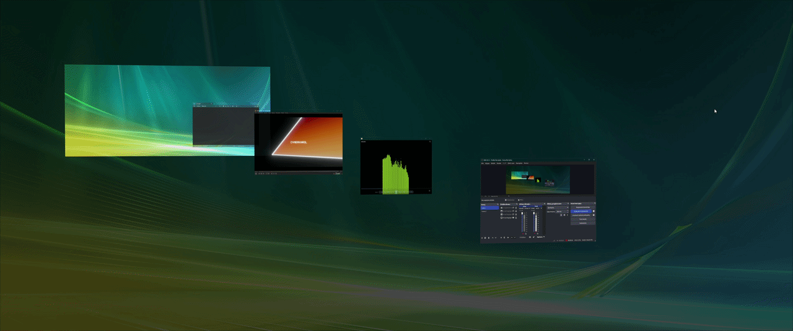
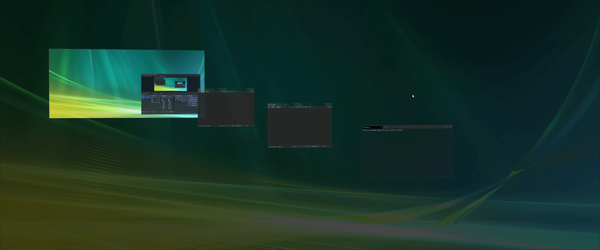

<div align="center">


# CKFlip3D

**The classic 3D window-switching experience, reborn for Windows 11.**

A native D3D11 window switcher in the spirit of the classic Flip 3D — a full 3D cascade, live window previews, and buttery entry/exit animations, running as a lightweight tray app on modern Windows.

`v1.2` · Windows 11 · C++20 / Direct3D 11 · WPF Settings & Installer (.NET 10) · PolyForm Noncommercial 1.0.0

</div>

---

## Showcase

<div align="center">

**Live preview** — windows keep playing inside the cascade (video, OBS, anything):



**Cycling the stack** — Tab / Shift+Tab / mouse wheel rotation with motion blur:


**Close animation** — windows closed mid-cascade fade out while the stack smoothly reflows:



<sub>3440x1440 resolution | 50 fps framerate</sub>

</div>

---

## What is CKFlip3D?

Windows 7 shipped **Flip 3D** (Win+Tab) — a 3D cascade of all your open windows. Microsoft removed it in Windows 8, and that style of window switching has been missing ever since. CKFlip3D is an original, written-from-scratch project that brings the experience to Windows 11:

- The cascade geometry (tile tilt, camera framing, depth curve, per-count density) is **entirely original work, hand-tuned by eye** until the motion feels the way people remember that era of desktop UI — every constant in the scene is CKFlip3D's own.
- Rendering is a **DirectComposition overlay** (`WS_EX_NOREDIRECTIONBITMAP`) with a premultiplied-alpha D3D11 swap chain — no GDI, no flicker, no redirection-surface overhead.
- Window contents come from **Windows Graphics Capture** sessions per window, with DWM-thumbnail and `PrintWindow` fallbacks so even minimized windows get real content.
- It runs quietly in the **system tray**, hooks the activation combo with a low-level keyboard hook, and consumes essentially zero CPU while idle.

## Why CKFlip3D?

There are plenty of Alt+Tab replacements. This is not one of them — it is a nostalgia-driven original with modern engineering underneath:

| | Windows 11 Win+Tab | Classic Flip 3D (Win7) | **CKFlip3D** |
|---|---|---|---|
| 3D cascade | ✕ flat grid | ✓ | ✓ full 3D cascade |
| Live window previews | ✓ | ✓ | ✓ streaming, per-window |
| Hold-to-flip semantics | ✕ | ✓ | ✓ (plus toggle mode) |
| Desktop as part of the stack | ✕ | ✓ | ✓ incl. dynamic wallpapers |
| Custom hotkey / mouse triggers | ✕ | ✕ | ✓ fully rebindable |
| Per-animation tuning, quality profiles | ✕ | ✕ | ✓ |
| Works on Windows 11 | ✓ | ✕ | ✓ |

And some things you won't see in a feature grid:

- **Zero telemetry, fully offline.** No network code anywhere in the app. Your window contents never leave the GPU.
- **Tiny footprint.** One native exe in the tray; the render loop literally does not exist until you press the hotkey (blocking message loop, 0% CPU idle).
- **No third-party dependencies in the core.** The C++ engine links only OS libraries — D3D11, DXGI, DirectComposition, DWM, WinRT capture.

## Features

### The cascade
- **Signature 3D stack** — up to 10 visible tiles with adaptive camera framing; window counts beyond the limit stay in the rotation and wrap into view as you cycle.
- **Live previews** — every tile streams its window's actual content. Videos keep playing, terminals keep scrolling. Can be switched to static snapshots to save GPU.
- **V-Sync live preview mode** — paces rendering to your monitor's refresh so every refresh shows a fresh preview frame.
- **Desktop tile & wallpaper backdrop** — the desktop is part of the stack (like the original), and the dimmed wallpaper backdrop is captured live, so **dynamic wallpapers (Wallpaper Engine, Lively) keep animating** behind the cascade.
- **Taskbar preview** — the real taskbar is hidden for the session and redrawn inside the overlay, with optional **live taskbar preview** and correct handling of auto-hide taskbars (they retract with the shell's own animation on exit).
- **Multi-monitor support** — the overlay spans all monitors; the cascade is staged on the primary display while secondary monitors dim and show their own taskbar previews.

### Animations
- **Entry/exit morph** — windows lift off their real desktop positions into the cascade and land back exactly where they were; minimized windows emerge from their taskbar buttons. Releasing the key mid-entry folds the morph back smoothly instead of snapping.
- **Cycle animation** — Tab-key rotation with wrap-around tile fly-by, queued input for continuous motion when the key is held, and velocity-driven **motion blur**.
- **Close animation** — close a window while the cascade is up (its own ✕, taskbar, anywhere) and the stack reflows smoothly while the dead tile fades out; burst-closes merge into one transition.
- Every animation can be toggled individually, or all disabled for an instant-snap switcher.

### Control
- **Hold-to-flip** — hold the modifier, tap Tab to cycle, release to commit to the selected window (classic Win+Tab semantics). Enter commits, Esc cancels.
- **Custom activation hotkey** — any combination like `Ctrl+Alt+F`, a bare mouse button (`MButton`, `XButton1`…), or single-key toggle mode.
- **Mouse wheel cycling** and **arrow-key navigation** while the cascade is up.
- **Ignore list** — exclude specific apps from the stack; optional fullscreen-app passthrough so games never lose Win+Tab.

### Quality & performance
- **Auto performance tune** — measures real frame times and adjusts quality both ways: it steps effects down (motion blur → antialiasing → live previews) when a device genuinely can't hold ~60 fps, and **steps them back up** once there is headroom again. High-refresh displays are treated fairly — running below 144 Hz is not "too slow".
- **Manual profiles** (Low / Medium / High), anisotropic tile filtering, configurable background dim opacity, capture warm-up budget tuning.
- Idle cost is effectively zero: the render loop only exists while the cascade is visible.

## Under the hood

A few engineering details for the curious:

- **Flash-free activation.** The first content frame (wallpaper + taskbar + tiles at their true desktop positions) is rendered into the composition swap chain *before* the overlay window is shown — there is no black flash, ever.
- **Capture warm-up with early exit.** Activation pumps compositor cycles until every capture has delivered its first frame, bounded by a budget derived from your refresh rate — so it waits exactly as long as the slowest window needs and not a tick more.
- **Warm capture cache.** Dismissing the cascade parks each window's capture with its last frame; the next activation shows content instantly while sessions restart in the background.
- **Session-frozen textures during animation.** While a cycle or morph is in flight, tiles render from frozen texture references so a live capture resizing mid-animation can never glitch a frame.
- **Draw-order correctness.** Tiles, overflow tiles and dying (closing) tiles share one back-to-front depth sort per frame — the painter's algorithm never inverts the stack, even mid-morph.
- **UIPI-aware IPC.** The elevated core and the unelevated settings app talk through registered window messages with explicit message-filter allow-listing, so Apply works without a manual restart.
- **Cross-build taskbar handling.** Windows 11 24H2 and 25H2 deliver structurally different taskbar captures; CKFlip3D measures the capture's content band at runtime and adapts, instead of hard-coding either behavior.

## Usage

| Input | Action |
|-------|--------|
| Hold `Win` + tap `Tab` | Open the cascade / cycle forward |
| `Shift+Tab` / `↓` / wheel down | Cycle backward |
| `Tab` / `↑` / wheel up | Cycle forward |
| Release `Win` / `Enter` | Commit — switch to the front window |
| `Esc` | Cancel — everything returns to where it was |

*(The activation combination is fully rebindable in Settings → Controls.)*

## Settings app

A full WPF settings application (dark/light theme, live theme fade) launched from the tray icon:

| Page | What it controls |
|------|------------------|
| **General** | Autostart (elevated scheduled task), performance profile & auto-tune, start delay, max windows, debug output |
| **Appearance** | Theme, background opacity, antialiasing, motion blur, per-animation toggles, live preview / V-Sync / taskbar preview options |
| **Controls** | Activation hotkey capture, mouse wheel & keyboard navigation, fullscreen ignore |
| **Ignored apps** | Per-exe exclusion list |
| **Multi-monitor** | Monitor behavior for the cascade |
| **Diagnostics** | Runtime/system info for bug reports |
| **Recovery** | Safe Mode launch (all effects off + diagnostics log), config reset |

Changes apply live — the settings app broadcasts a reload message and the running core picks the new `config.json` up without a restart (config lives in `%APPDATA%\CKFlip3D\config.json`).

## Installation

Grab **`CKFlip3D.Setup.exe`** from [Releases](../../releases), run it, and follow the wizard. That's it — CKFlip3D starts with Windows (if you opt in) and lives in the tray.

The installer is a single file with a modern WPF wizard:

- Embedded payload — no downloads needed for the app itself; the **.NET Desktop Runtime is bootstrapped automatically** if missing.
- Install directory & shortcut options, optional autostart task.
- **Full rollback** — any failure or cancel mid-install unwinds every file, shortcut and registry change.
- Registered in *Apps & Features* with a proper uninstaller (the same engine runs install and uninstall).

To remove it, use *Apps & Features* → CKFlip3D → Uninstall, or run the uninstaller from the install folder.

## Requirements

- **Windows 11** (Windows Graphics Capture & DirectComposition are core dependencies; taskbar preview adapts to 24H2/25H2 capture differences automatically)
- A **D3D11-capable GPU** (WARP software fallback exists but is not recommended)
- **.NET 10 Desktop Runtime** for the Settings app — installed automatically by the setup wizard
- Administrator elevation (required to hook and cloak elevated windows; installed autostart uses an elevated scheduled task)

## FAQ

**Does it replace Win+Tab?**
By default, yes — the hook swallows Win+Tab and opens the cascade instead of Task View. Rebind the activation combo in Settings and Win+Tab goes back to Windows.

**Does it work with games?**
Yes. Enable *Ignore fullscreen apps* and the hotkey passes straight through while a fullscreen game has focus.

**Multiple monitors?**
Yes — the cascade runs on the primary display, secondary monitors dim and keep their taskbar previews. Per-monitor behavior is configurable.

**Does it work on Windows 10?**
Officially no — CKFlip3D targets Windows 11. Core APIs exist on late Windows 10 builds, but the taskbar handling is built for the Windows 11 shell.

**How heavy is it?**
Idle: one sleeping process, 0% CPU. Active: a few milliseconds of GPU per frame, only while the cascade is on screen. Live previews can be turned off (or auto-tune down) on weak GPUs.

**Something broke — what now?**
Settings → Recovery → **Safe Mode** starts the core with every effect off and writes a diagnostics log (`%APPDATA%\CKFlip3D\safemode.log`). The Diagnostics page collects the system info worth attaching to a bug report.

## Building from source

Three independent builds, one output folder (`build/`):

```bat
:: Core (C++20, MSVC Build Tools required)
build.bat

:: Settings app (WPF, .NET 10 SDK)
core\Settings\build_settings.bat

:: Installer (packages build output into a single setup exe)
core\Installer\build_installer.bat
```

The core links only OS libraries (`d3d11`, `dxgi`, `dcomp`, `dwmapi`, `windowsapp`, …) — no third-party dependencies.

### Project layout

```
core/        App shell, tray icon, config, FlipController (session orchestration)
             ├─ Settings/   WPF settings app
             └─ Installer/  WPF setup wizard + install/uninstall engine
render/      D3D11 device, DirectComposition swap chain, quad renderer + shaders
scene/       Cascade geometry — layout & camera math
animation/   Entry/exit morph, cycle rotation, close reflow, easing
capture/     WGC sessions, window scanner, DWM cloaking, taskbar button locator
hook/        Low-level keyboard/mouse hook & hotkey parsing
```

## Roadmap

- Visual presets — alternative looks for the 3D switcher
- Background blur behind the cascade
- More appearance customization

Bug reports with the Diagnostics page output attached are very welcome.

## License

CKFlip3D is source-available under the **[PolyForm Noncommercial License 1.0.0](LICENSE.md)**.

- You may use, copy, modify and share it freely for any **noncommercial** purpose.
- Any copy you pass on must include the license terms (or their URL) and the notice below.
- **Commercial use requires a separate license** — contact the author via GitHub.

> Required Notice: Copyright © 2026 Karol Cymerman (CYMERKAROL) — <https://github.com/CYMERKAROL/CKFlip3D>

## Credits

Built by **CYMERKAROL**. An original, independent project inspired by a classic era of desktop UI. Not affiliated with, endorsed by, or sponsored by Microsoft Corporation.
