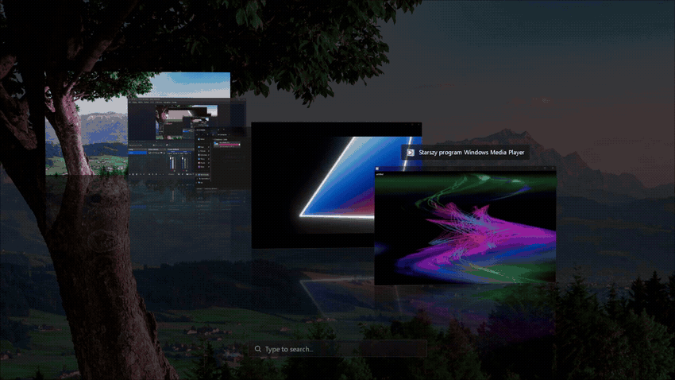
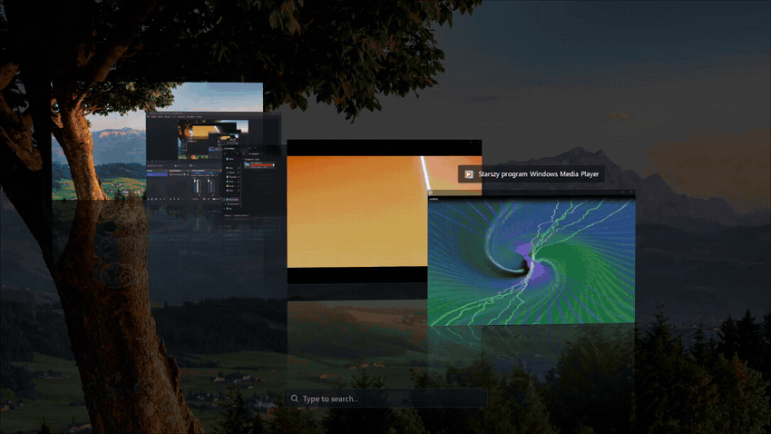
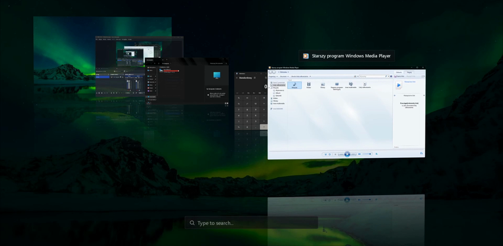
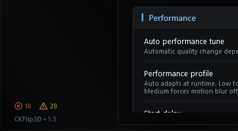
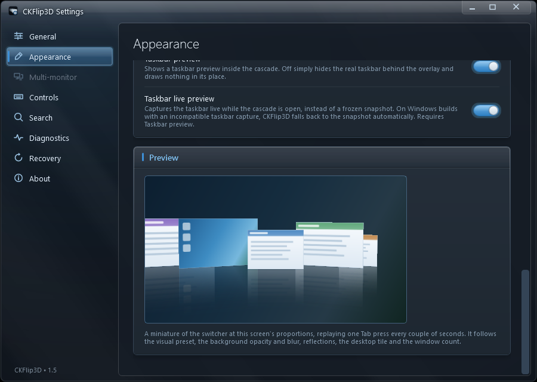
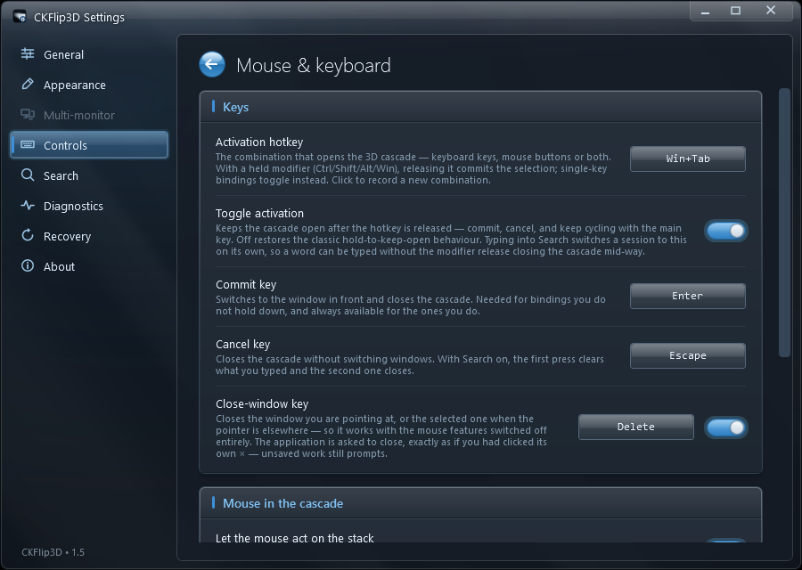
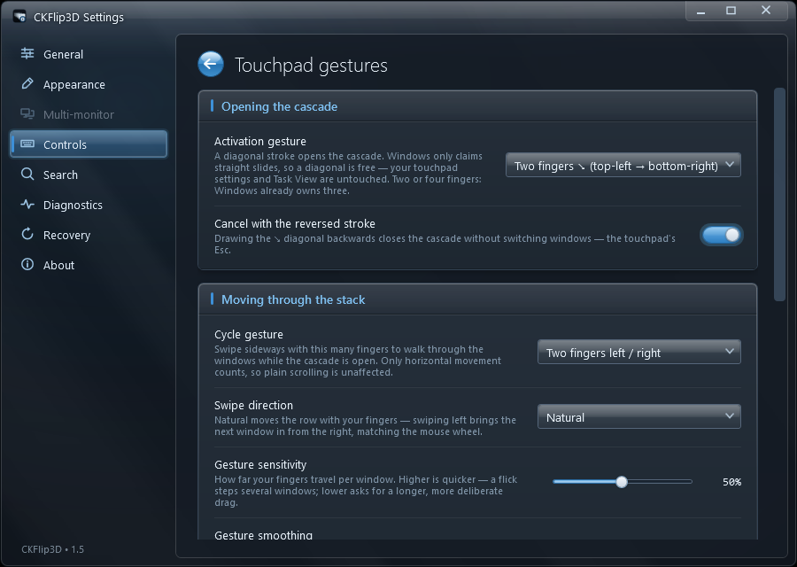
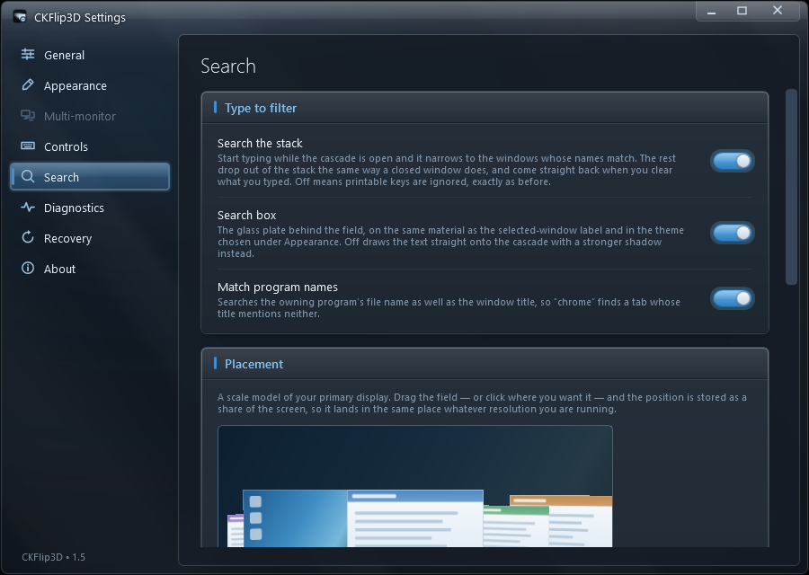
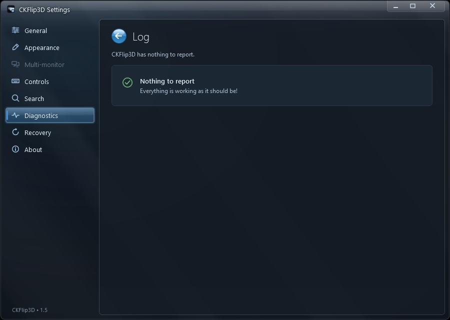

<div align="center">


# CKFlip3D

**The classic 3D window-switching experience, reborn for Windows 11.**

A native D3D11 window switcher in the spirit of the classic Flip 3D — a full 3D cascade, live window previews, and buttery entry/exit animations, running as a lightweight tray app on modern Windows.

`v1.5` · Windows 11 · C++20 / Direct3D 11 · WPF Settings & Installer (.NET 10) · PolyForm Noncommercial 1.0.0

</div>

---

## Showcase

<div align="center">

**Live preview** — windows keep playing inside the cascade (video, OBS, anything):



**Cycling the stack** — Tab / Shift+Tab / mouse wheel rotation with motion blur:


**Close animation** — windows closed mid-cascade fade out while the stack smoothly reflows:



### New in 1.5

**Cover Flow** — the new centered carousel preset, cycling through the stack:


**Pick with the mouse** — hovering lifts a tile off the stack, clicking commits to it:


**Free stack movement** — with Window snap off, the mouse *throws* the carousel and it settles on the nearest window:


**Type to filter** — the stack narrows to the windows that match as you type:


**Reflections** — every tile mirrors softly onto the glass floor below it (shown here on the classic cascade):



<sub>1920x1080 · 50 fps · real desktop capture, untouched</sub>

</div>

---

## What is CKFlip3D?

**A 3D window switcher for Windows 11 — written from scratch, in C++ and Direct3D 11.**

It began as a revival. Windows 7 shipped **Flip 3D** (Win+Tab), a 3D cascade of your open windows; Microsoft removed it in Windows 8 and nothing replaced it. Rebuilding that cascade properly meant writing a real-time renderer, a capture pipeline and an input layer from nothing — and once those existed, the cascade turned out to be one thing they could draw rather than the whole point of them.

So CKFlip3D is no longer a Flip 3D clone with extras bolted on. It is a switcher with its own engine, in which the Windows 7 cascade is **one of two layouts** — faithful, still the default, and now sitting beside a **Cover Flow** carousel that the original never had. You reach either one with the keyboard, the mouse or a touchpad gesture, and you can type to filter it.

- **Two layouts, one engine.** Cascade and Cover Flow are different geometry over a shared scene, so every animation, every capture and every input path works identically in both — nothing is a special case.
- **The geometry is original work.** Tile tilt, camera framing, depth curve, per-count density, the carousel's spacing solver — every constant is CKFlip3D's own, hand-tuned by eye until the motion feels right.
- **Rendering is a DirectComposition overlay** (`WS_EX_NOREDIRECTIONBITMAP`) with a premultiplied-alpha D3D11 swap chain — no GDI, no flicker, no redirection-surface overhead.
- **Window contents come from Windows Graphics Capture**, per window, with DWM-thumbnail and `PrintWindow` fallbacks so even minimized windows get real content.
- **It costs nothing when you are not using it.** One native exe in the tray; the render loop does not exist until you press the hotkey.

## What's new in 1.5

1.5 is the biggest release since the first public one. Two things to know up front:

- **Nothing about the classic cascade changed.** Every new look is a preset you opt into, and the default preset is bit-for-bit the 1.2 cascade.
- **The new input paths are opt-in.** Upgrading from 1.2 keeps the switcher you already know — mouse interaction and search are off until you turn them on, so an upgrade never quietly grows new behaviour, least of all a binding that closes a window.

| | What it is | Default |
|---|---|---|
| **Cover Flow preset** | A centered carousel — the selected window flat in the middle, the rest fanning out and leaning outward on a common floor plane | Off (Cascade) |
| **Reflections** | A soft glass-floor mirror under every tile, in both presets | Off |
| **Mouse in the cascade** | Hover lifts a tile, click picks it, middle-click closes it, right-drag scrubs the stack | Off |
| **Type-to-filter search** | Start typing and the stack narrows to the matching windows | Off |
| **Touchpad gestures** | A two-finger diagonal opens the cascade; two-finger swipes cycle it; a tap commits | On |
| **Free stack movement** | Turn Window snap off and the stack scrubs continuously instead of stepping window by window | Off (snap on) |
| **Rebindable commit / cancel / close keys** | Enter, Esc and Delete are now settings rather than constants | Enter / Esc / Delete |
| **Diagnostics log** | The app records its own failures with stable codes and shows them in Settings | On |
| **Live 3D preview in Settings** | The Appearance page renders a real miniature of your cascade, not a mockup | — |

## Why CKFlip3D?

There are plenty of Alt+Tab replacements, and this is not one of them. It is a purpose-built 3D switcher: an original engine that happens to know the layout everyone remembers, and one it invented alongside it.

| | Windows 11 Win+Tab | Classic Flip 3D (Win7) | **CKFlip3D** |
|---|---|---|---|
| 3D presentation | ✕ flat grid | ✓ cascade | ✓ cascade **and** Cover Flow |
| Live window previews | ✓ | ✓ | ✓ streaming, per-window |
| Hold-to-flip semantics | ✕ | ✓ | ✓ plus toggle mode |
| Desktop as part of the stack | ✕ | ✓ | ✓ incl. dynamic wallpapers |
| Reflections on a glass floor | ✕ | ✕ | ✓ both layouts |
| Type to filter the switcher | ✕ | ✕ | ✓ title *and* program name |
| Close a window from the switcher | ✓ | ✕ | ✓ mouse button or key |
| Hover feedback on the stack | ✕ | ✕ | ✓ the tile lifts |
| Continuous, non-stepped movement | ✕ | ✕ | ✓ drag or swipe to scrub |
| Gesture to open **and** move through it | ✕ opens only | ✕ | ✓ diagonal opens, swipe cycles |
| Custom activation hotkey | ✕ | ✕ | ✓ keys or mouse buttons |
| Rebindable commit / cancel / close keys | ✕ | ✕ | ✓ |
| Exclude apps from the stack | ✕ | ✕ | ✓ per-exe list |
| Per-animation tuning, quality profiles | ✕ | ✕ | ✓ |
| Tells you when something went wrong | ✕ | ✕ | ✓ diagnostics log |
| Works on Windows 11 | ✓ | ✕ | ✓ |

And some things you won't see in a feature grid:

- **Zero telemetry, fully offline.** No network code anywhere in the app. Your window contents never leave the GPU.
- **Tiny footprint.** One native exe in the tray; the render loop literally does not exist until you press the hotkey (blocking message loop, 0% CPU idle).
- **No third-party dependencies in the core.** The C++ engine links only OS libraries — D3D11, DXGI, DirectComposition, DWM, WinRT capture.

## Features

### The two layouts

Switched with a single dropdown (Appearance → Visual preset). They are geometry over a shared scene, so everything in the rest of this list applies to both.

#### Cascade *(default)*

The classic diagonal stack, faithful to the Windows 7 original and unchanged since 1.2 — up to 10 visible tiles with adaptive camera framing, receding into the screen at a hand-tuned depth curve and per-count density. Window counts beyond the limit stay in the rotation and wrap into view as you cycle.

#### Cover Flow

A centered carousel: the selected window flat in the middle, the rest fanning out to either side and leaning gently outward, all standing on a common floor plane. The row divides the screen evenly, and for long rows the tile size is *solved* rather than guessed — so as the window count grows the deck scales down instead of collapsing into a pile, and every window the counter promises stays genuinely visible.

### The stack

- **Reflections** — an optional glass floor: each tile mirrors softly below its bottom edge with a quadratic falloff. Works in both layouts, and costs exactly zero extra draw calls when off.
- **Live previews** — every tile streams its window's actual content. Videos keep playing, terminals keep scrolling. Can be switched to static snapshots to save GPU.
- **V-Sync live preview mode** — paces rendering to your monitor's refresh so every refresh shows a fresh preview frame.
- **Desktop tile & wallpaper backdrop** — the desktop is part of the stack (like the original), and the dimmed wallpaper backdrop is captured live, so **dynamic wallpapers (Wallpaper Engine, Lively) keep animating** behind it.
- **Background blur** — optional frosted-glass blur on the wallpaper behind the stack, with zero GPU cost at 0%.
- **Taskbar preview** — the real taskbar is hidden for the session and redrawn inside the overlay, with optional **live taskbar preview** and correct handling of auto-hide taskbars (they retract with the shell's own animation on exit).
- **Multi-monitor support** — the overlay spans all monitors; the stack is staged on the primary display while secondary monitors dim and show their own taskbar previews.

### Animations
- **Entry/exit morph** — windows lift off their real desktop positions into the cascade and land back exactly where they were; minimized windows emerge from their taskbar buttons. Releasing the key mid-entry folds the morph back smoothly instead of snapping.
- **Cycle animation** — Tab-key rotation with wrap-around tile fly-by, queued input for continuous motion when the key is held, and velocity-driven **motion blur**.
- **Close animation** — close a window while the cascade is up (its own ✕, taskbar, anywhere) and the stack reflows smoothly while the dead tile fades out; burst-closes merge into one transition.
- **Hover lift** — the tile under the pointer rises off the stack and settles back when the pointer leaves. It is a draw-time offset, so it composes with every other animation instead of fighting it, and it rides along with the tile when you cycle mid-hover.
- **Selected window label** — the front window's title and program icon on a themed plate above the tile, with its own glide animation.
- Every animation can be toggled individually, or all disabled for an instant-snap switcher.

### Control

**Keyboard**
- **Hold-to-flip** — hold the modifier, tap Tab to cycle, release to commit to the selected window (classic Win+Tab semantics).
- **Toggle activation** — combo hotkeys can keep the cascade open after the modifier is released; single-key bindings are inherently toggle.
- **Custom activation hotkey** — any combination like `Ctrl+Alt+F`, a bare mouse button (`MButton`, `XButton1`…), or single-key toggle mode.
- **Rebindable commit, cancel and close keys** — `Enter`, `Esc` and `Delete` by default, each set by simply pressing the key you want.
- **Arrow-key navigation** and **mouse wheel cycling** while the cascade is up.

**Mouse in the cascade** *(off by default — one master switch turns the whole group on)*
- **Hover and pick** — the tile under the pointer lifts; clicking it commits. A window deep in the stack first spins to the front on the ordinary cycle path, then the usual exit morph plays, so a click and a Tab-and-release land identically.
- **Close a window** — middle-click (or the close key) sends `WM_CLOSE` to the hovered window, so the app runs its own close path, save prompts included.
- **Drag the stack** — with Window snap off, the right button scrubs the stack continuously.
- Hover and clicks are ignored while the stack is moving, because a moving stack puts a different window under a still pointer every frame.

**Touchpad gestures** *(on by default, Windows Precision Touchpad)*
- **Open** with a two-finger diagonal stroke. Diagonals are used deliberately: Windows' own slide recogniser only claims the four cardinal directions, so nothing in your Windows gesture configuration has to be taken away.
- **Cycle** with a two-finger horizontal swipe — horizontal dominance is required, so ordinary two-finger scrolling is untouched.
- **Commit** with a one-finger tap, **cancel** by drawing the opening stroke backwards.
- Finger count, direction, sensitivity and smoothing are all configurable, and the whole listener is never even registered when the master switch is off.

**Free stack movement**
- **Window snap** (on by default) lands every step squarely on a window. Turn it off and the mouse drag and touchpad swipe **scrub the stack continuously** — it follows at whatever speed you move, can be held between two windows, and settles onto the nearest one when released. The keyboard and wheel keep stepping one window at a time either way, because those are discrete inputs by design.

**Filtering**
- **Ignore list** — exclude specific apps from the stack; optional fullscreen-app passthrough so games never lose Win+Tab.

### Search *(off by default)*
- **Type to filter** — with the cascade open, just start typing and the stack narrows to the windows that match.
- **Matches words, in any order, across the title *and* the program name** — `code set` finds *Settings — Visual Studio Code*, and `chrome` finds a tab whose title mentions neither.
- **Windows leave and return the way a closed one does** — filtered-out windows slide out on the close animation and *rise back into place* when you delete a character, instead of flying across the stack through each other.
- **A query that matches nothing empties the stack and says so** — and the cascade then refuses to commit, so a typo can never switch you to the wrong window.
- **Themed field**, placed anywhere on screen by percentage (so one setting reads the same on every display) and scalable from 50–200% — the text is *rendered* at the chosen size rather than magnified, so a bigger field is genuinely bigger type.
- Requires **Toggle activation**, for a concrete reason: otherwise letting go of the hotkey to type would commit, and the rest of your word would reach Windows as shortcuts.

### Quality & performance
- **Auto performance tune** — measures real frame times and adjusts quality both ways: it steps effects down (motion blur → antialiasing → live previews) when a device genuinely can't hold ~60 fps, and **steps them back up** once there is headroom again. High-refresh displays are treated fairly — running below 144 Hz is not "too slow".
- **Manual profiles** (Low / Medium / High), anisotropic tile filtering, configurable background dim opacity, capture warm-up budget tuning.
- Idle cost is effectively zero: the render loop only exists while the cascade is visible.

### Diagnostics

CKFlip3D spends its life behind an overlay, inside a keyboard hook, on a GPU it does not own. When something fails there it used to leave no trace. Now it keeps a log about itself:

- **Every failure is an entry** with a stable code, a severity, a plain-language line for you and a technical one for a bug report — a capture that never delivered a frame, a window that stayed cloaked, a device that was lost, a config that would not parse.
- **Clearing is a watermark, not a deletion** — a problem that happens again is news again, so it comes back. Entries that state a fact about the machine rather than an event stay cleared for good.
- **A program working correctly produces no entries at all** — nothing routine to scroll past, so a mark in the sidebar always means something.
- The log lives at `%APPDATA%\CKFlip3D\diagnostics.jsonl`, one JSON object per line, and nothing is ever sent anywhere.

**Two severities, and they mean different things.** They appear as counts in the **bottom-left corner of the Settings window**, above the version — and only when there is something to report:

<div align="center">



</div>

| Mark | Severity | What it means |
|---|---|---|
| **✕ in a red circle** | **Error** | The thing you asked for **did not happen** — the cascade could not open, a window stayed hidden, settings could not be saved. |
| **! in an amber triangle** | **Warning** | It happened, but **degraded** — a feature switched itself off, fell back to a slower path, or was approximated. |

Clicking the marks opens the log — one tile per problem, worst first, with when it last happened and how many times.

## Under the hood

A few engineering details for the curious:

- **Flash-free activation.** The first content frame (wallpaper + taskbar + tiles at their true desktop positions) is rendered into the composition swap chain *before* the overlay window is shown — there is no black flash, ever.
- **Capture warm-up with early exit.** Activation pumps compositor cycles until every capture has delivered its first frame, bounded by a budget derived from your refresh rate — so it waits exactly as long as the slowest window needs and not a tick more.
- **Warm capture cache.** Dismissing the cascade parks each window's capture with its last frame; the next activation shows content instantly while sessions restart in the background.
- **Session-frozen textures during animation.** While a cycle or morph is in flight, tiles render from frozen texture references so a live capture resizing mid-animation can never glitch a frame.
- **Draw-order correctness.** Tiles, overflow tiles and dying (closing) tiles share one back-to-front depth sort per frame — the painter's algorithm never inverts the stack, even mid-morph.
- **Cover Flow is solved, not guessed.** Tile *outer edges* are distributed evenly in screen measure rather than tile centres in world space — a turned quad's two corners go through the perspective divide separately, and the near one projects noticeably wider. The tile size is then solved for the widest row the layout could ever hold, so the deck does not breathe as the carousel turns.
- **Reflections in their own pass.** Every mirror is drawn back-to-front *before* any tile, because a common floor plane projects deeper tiles' bottom edges higher on screen — interleaving them lets a near tile's mirror paint across the face of a deeper neighbour.
- **The pointer hit test agrees with the picture.** It projects each slot's actual MVP quad, and tests the *union* of the resting and lifted poses — feeding it the lifted pose alone would close a loop (the lift decides the hit, the hit decides the target, the target decides the lift) and flicker along the tile's lower edge.
- **Input sources cannot be told apart.** The touchpad worker and the keyboard hook post the *same* messages, so the whole controller path is single-threaded and shared; a gesture-opened cascade still takes Tab and Esc, and a Win+Tab-opened one still takes gestures.
- **Append-only diagnostics.** Entries are written with a single `WriteFile` on a `FILE_APPEND_DATA` handle — the one shape of write Windows will not interleave between processes — so the core, the Settings app and a second copy of either can all append with no lock between them, and a reader always sees whole lines.
- **UIPI-aware IPC.** The elevated core and the unelevated settings app talk through registered window messages with explicit message-filter allow-listing, so Apply works without a manual restart.
- **Cross-build taskbar handling.** Windows 11 24H2 and 25H2 deliver structurally different taskbar captures; CKFlip3D measures the capture's content band at runtime and adapts, instead of hard-coding either behavior.

## Usage

| Input | Action |
|-------|--------|
| Hold `Win` + tap `Tab` | Open the cascade / cycle forward |
| `Shift+Tab` / `↓` / wheel down | Cycle backward |
| `Tab` / `↑` / wheel up | Cycle forward |
| Release `Win` / `Enter` | Commit — switch to the front window |
| `Esc` | Cancel — everything returns to where it was |
| *Type any text* | Filter the stack (Search, needs Toggle activation) |
| `Delete` | Close the hovered / selected window |

With **mouse in the cascade** switched on:

| Input | Action |
|-------|--------|
| Move the pointer | The tile underneath lifts |
| Left click | Pick that window (spins it forward first if it is deep in the stack) |
| Middle click | Close that window |
| Right drag | Scrub the stack freely (when Window snap is off) |

With **touchpad navigation** on (default):

| Gesture | Action |
|---------|--------|
| Two fingers, diagonal ↘ | Open the cascade |
| Two fingers, swipe left / right | Cycle the stack |
| One-finger tap | Commit |
| The opening stroke, reversed | Cancel |

*(Every key, button and gesture above is rebindable in Settings → Controls.)*

## Settings app

CKFlip3D ships with a full WPF settings application — its own themed window with a nav rail, launched from the tray icon. It is not a property sheet: every option carries a sentence explaining what it actually does, several pages render a **live miniature of your real configuration**, and any binding is set by simply performing it.

<div align="center">

| | |
|:--:|:--:|
|  |  |
| **Appearance** — a real miniature of your cascade | **Mouse & keyboard** — every key set by pressing it |
|  |  |
| **Touchpad gestures** — gestures, direction, sensitivity | **Search** — filtering, and the field's placement |

</div>

### The pages

| Page | What it controls |
|------|------------------|
| **General** | Autostart (elevated scheduled task), exclusion list, Window snap, performance profile & auto-tune, start delay, max windows, debug output |
| **Appearance** | Theme, **visual preset**, background opacity & blur, desktop tile, selected-window label, antialiasing, motion blur, **reflections**, per-animation toggles (incl. hover lift), live preview / V-Sync / taskbar preview |
| **Multi-monitor** | Monitor behavior for the cascade |
| **Controls** | Fullscreen ignore, ignored apps, wheel & arrow-key navigation, touchpad master switch — plus two sub-pages: |
| → **Mouse & keyboard** | Activation / commit / cancel / close keys, toggle activation, and the three in-cascade mouse bindings |
| → **Touchpad gestures** | Activation gesture, cycle gesture & direction, sensitivity, smoothing, tap-to-commit, cancel stroke |
| **Search** | Enable searching, the on-screen field, program-name matching, size and position |
| **Diagnostics** | Runtime/system info for bug reports, and the entry point to the **log** |
| **Recovery** | Panic Restore (force quit, uncloak all windows, restore taskbars & desktop icons), Safe Mode launch, config reset |

### Things worth knowing

- **The previews are the real thing.** The Appearance page renders an actual miniature cascade at your screen's proportions — following the visual preset, background opacity and blur, reflections, the desktop tile and the window count — and replays a Tab press every few seconds. The Search page shows a scale model of your display you can *drag the field around on*, and the Touchpad page has an activity panel driven by the **same gesture recogniser the core uses**, so you can practise a diagonal and watch it register.
- **Bindings are recorded, not typed.** Click the activation, commit, cancel or close-key button and press the combination you want — mouse buttons included.
- **Changes apply live.** Apply broadcasts a reload message and the running core picks up the new `config.json` without a restart (`%APPDATA%\CKFlip3D\config.json`).
- **Dependent settings explain themselves.** A combination the app will not save — searching without toggle activation, free stack movement with no pointer in the cascade — keeps Apply out of reach and names the switch that is holding it, rather than moving a switch under your hand or greying something out with no explanation.
- **The sidebar reports problems, and only problems.** A mark with a count appears next to Diagnostics when something has actually gone wrong; clicking through opens the log. When nothing has, the page says so and stays empty:

<div align="center">



</div>

- **Recovery is for when things go badly.** Panic Restore force-quits the core and repairs desktop state (uncloaks every window, re-shows taskbars and desktop icons); Safe Mode starts the core with every effect off; and a one-click reset restores factory defaults.

## Installation

Grab **`CKFlip3D.Setup.exe`** from [Releases](../../releases), run it, and follow the wizard. That's it — CKFlip3D starts with Windows (if you opt in) and lives in the tray.

The installer is a single file with a modern WPF wizard:

- Embedded payload — no downloads needed for the app itself; the **.NET Desktop Runtime is bootstrapped automatically** if missing.
- Install directory & shortcut options, optional autostart task.
- **Full rollback** — any failure or cancel mid-install unwinds every file, shortcut and registry change.
- Registered in *Apps & Features* with a proper uninstaller (the same engine runs install and uninstall).

Upgrading over a running copy is handled properly — the installer asks the running core to shut down cleanly, so it un-cloaks its windows and restores your taskbar before being replaced.

To remove it, use *Apps & Features* → CKFlip3D → Uninstall, or run the uninstaller from the install folder.

## Requirements

- **Windows 11** (Windows Graphics Capture & DirectComposition are core dependencies; taskbar preview adapts to 24H2/25H2 capture differences automatically)
- A **D3D11-capable GPU** (WARP software fallback exists but is not recommended)
- **.NET 10 Desktop Runtime** for the Settings app — installed automatically by the setup wizard
- Administrator elevation (required to hook and cloak elevated windows; installed autostart uses an elevated scheduled task)
- A **Windows Precision Touchpad** for the gesture features (everything else works without one)

## FAQ

**Does it replace Win+Tab?**
By default, yes — the hook swallows Win+Tab and opens the cascade instead of Task View. Rebind the activation combo in Settings and Win+Tab goes back to Windows.

**I upgraded from 1.2 — did anything change under me?**
The cascade itself, no: the default visual preset is the classic one and every new look is opt-in. Mouse interaction and search are off until you enable them. Touchpad gestures are the one addition that is on by default; the master switch is in Controls → Navigation.

**Does it work with games?**
Yes. Enable *Ignore fullscreen apps* and the hotkey passes straight through while a fullscreen game has focus.

**Multiple monitors?**
Yes — the cascade runs on the primary display, secondary monitors dim and keep their taskbar previews. Per-monitor behavior is configurable.

**Does it work on Windows 10?**
No — CKFlip3D requires Windows 11. The taskbar handling is built for the Windows 11 shell and will not work correctly on Windows 10.

**How heavy is it?**
Idle: one sleeping process, 0% CPU. Active: a few milliseconds of GPU per frame, only while the cascade is on screen. Live previews can be turned off (or auto-tune down) on weak GPUs. Reflections are the one new effect with a real cost, and they are off by default.

**Something broke — what now?**
Check **Settings → Diagnostics → Open the log** first: if CKFlip3D noticed the failure, it will be in there with a code and an explanation. Settings → Recovery → **Safe Mode** starts the core with every effect off, and Panic Restore repairs the desktop state (cloaked windows, hidden taskbars) if a session ever ends badly.

## Building from source

Three independent builds, one output folder (`build/`):

```bat
:: Core (C++20, MSVC Build Tools required)
build.bat

:: Settings app (WPF, .NET 10 SDK)
core\Settings\build_settings.bat

:: Installer (packages build output into a single setup exe)
core\Installer\build_installer.bat
```

The core links only OS libraries (`d3d11`, `dxgi`, `dcomp`, `dwmapi`, `windowsapp`, …) — no third-party dependencies.

### Project layout

```
core/        App shell, tray icon, config, diagnostics, search filter & box,
             FlipController (session orchestration)
             ├─ Settings/   WPF settings app
             └─ Installer/  WPF setup wizard + install/uninstall engine
render/      D3D11 device, DirectComposition swap chain, quad renderer + shaders
scene/       Cascade & Cover Flow geometry — layout & camera math
animation/   Entry/exit morph, cycle rotation, close reflow, hover lift, easing
capture/     WGC sessions, window scanner, DWM cloaking, taskbar button locator
hook/        Low-level keyboard/mouse hook, touchpad raw-input, hotkey parsing
input/       Tile hit testing for the pointer
```

## Roadmap

- More visual presets for the 3D switcher
- Further appearance customization
- Per-monitor cascade staging

Bug reports with the Diagnostics page output attached are very welcome.

## License

CKFlip3D is source-available under the **[PolyForm Noncommercial License 1.0.0](LICENSE.md)**.

- You may use, copy, modify and share it freely for any **noncommercial** purpose.
- Any copy you pass on must include the license terms (or their URL) and the notice below.
- **Commercial use requires a separate license** — contact the author via GitHub.

> Required Notice: Copyright © 2026 Karol Cymerman (CYMERKAROL) — <https://github.com/CYMERKAROL/CKFlip3D>

## Credits

Built by **CYMERKAROL**. An original, independent project inspired by a classic era of desktop UI. Not affiliated with, endorsed by, or sponsored by Microsoft Corporation.
